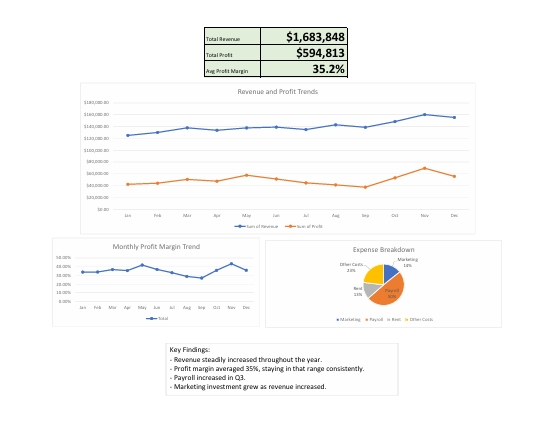

# Financial Performance Dashboard

## Project Summary

Developed an interactive financial performance dashboard in Microsoft Excel to analyze revenue, expenses, profitability, and operating performance. Utilized Pivot Tables, Pivot Charts, formulas, and conditional formatting to automate KPI calculations and support financial reporting.

## Overview

This project analyzes company financial performance using Microsoft Excel. The dashboard tracks revenue, expenses, profitability, and key financial KPIs through interactive visualizations and reporting tools.

## Tools Used

- Microsoft Excel
- Pivot Tables
- Pivot Charts
- Conditional Formatting
- Financial Analysis
- Dashboard Design

## Key Metrics

- Total Revenue
- Total Profit
- Average Profit Margin

## Dashboard Features

- Revenue & Profit Trend Analysis
- Monthly Profit Margin Tracking
- Expense Distribution Analysis
- KPI Reporting

## Key Findings

- Revenue increased throughout the year.
- Average profit margin exceeded 35%.
- Payroll expenses increased during the second half of the year.
- Profitability remained positive throughout the year.

## Files Included

- Financial_Dashboard_Project.xlsx
- Financial_Dashboard_Project.pdf
- Dashboard_Preview.jpeg
